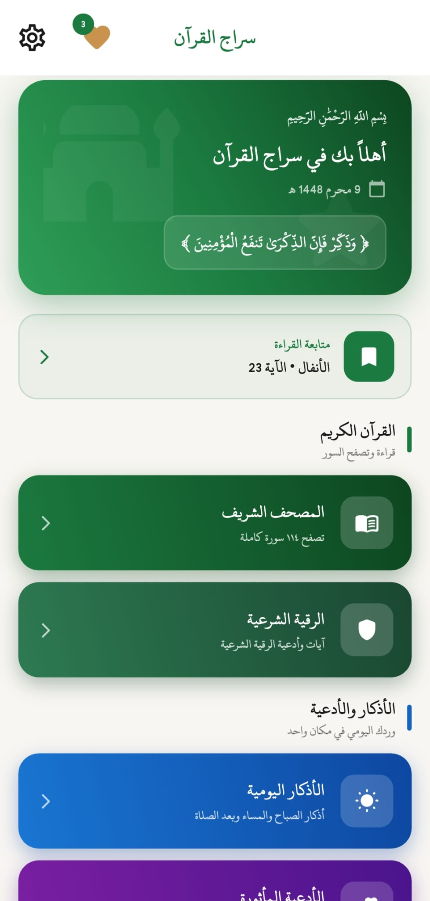
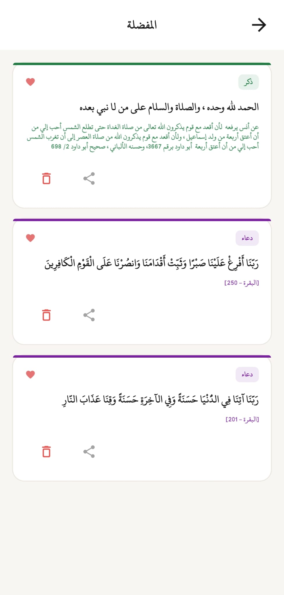
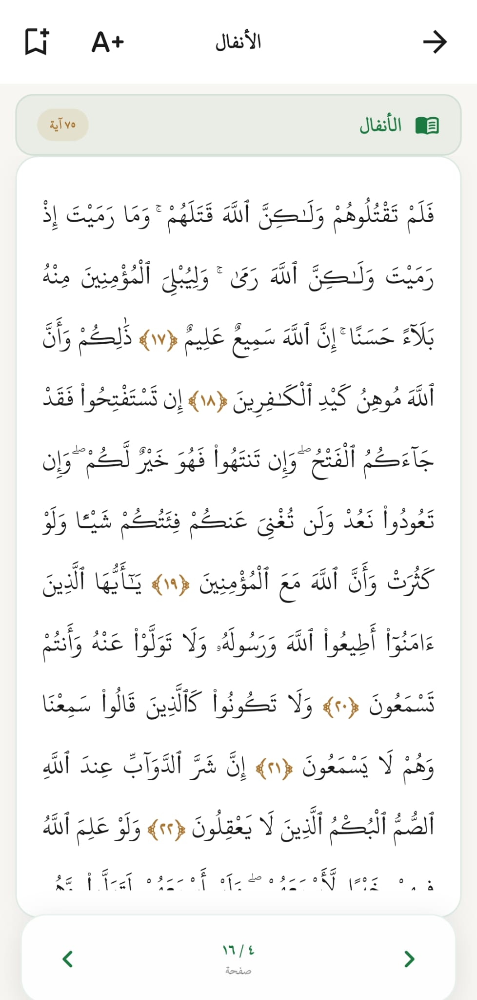
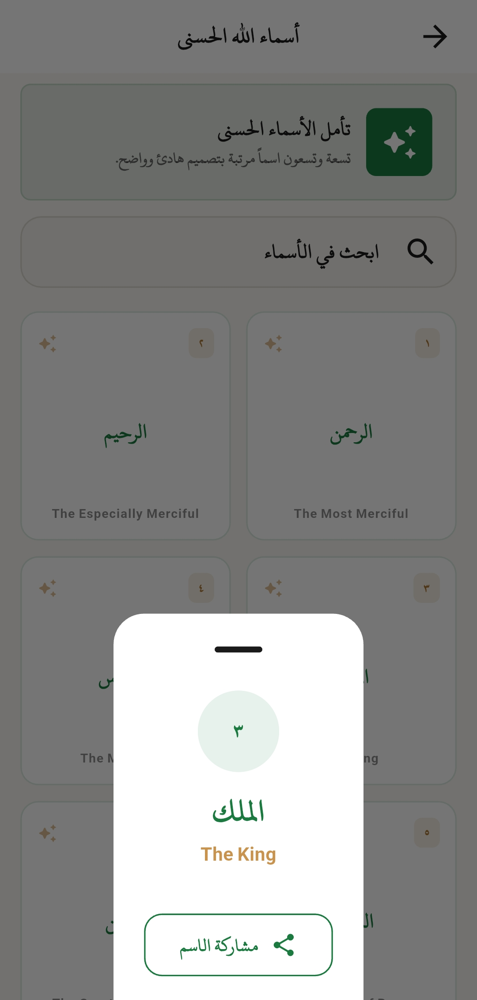
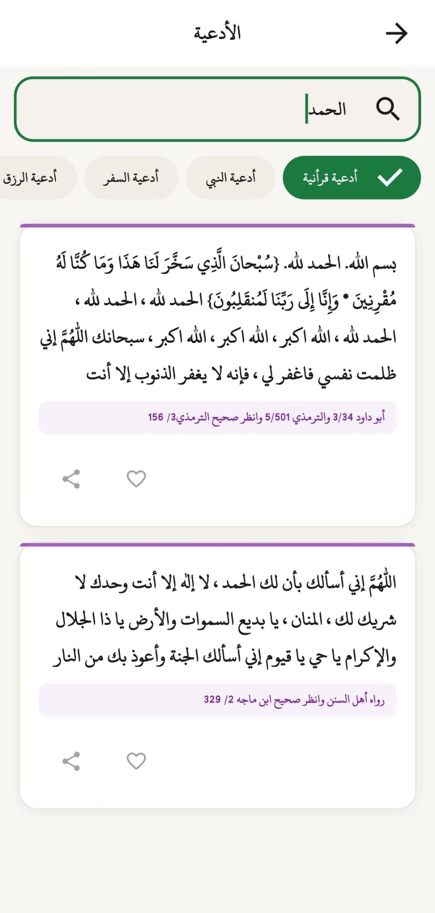
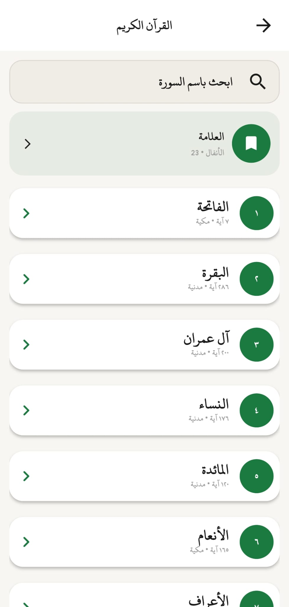
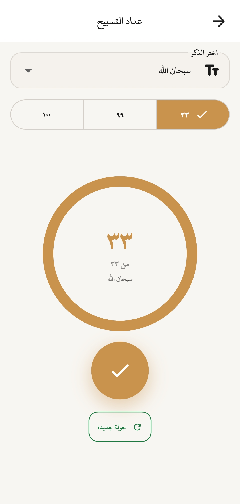
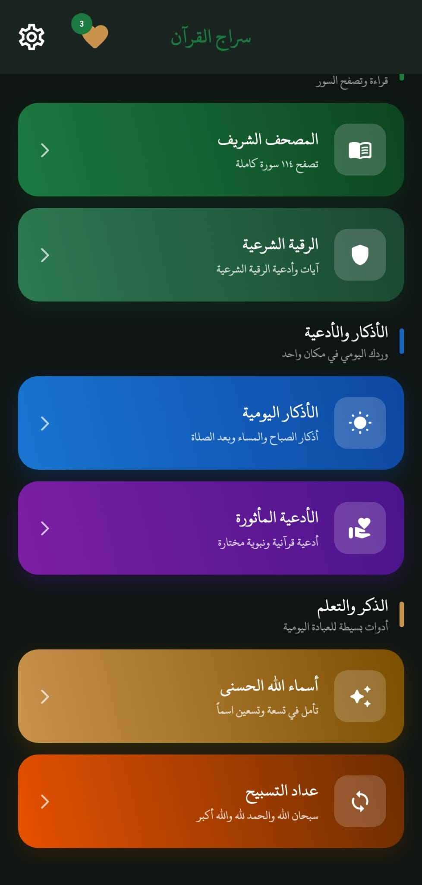
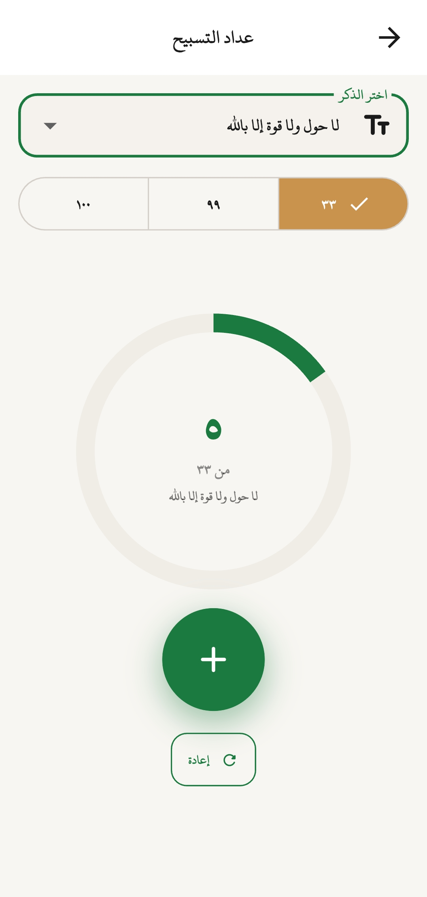

# 🕌 Siraj Al Quran - سراج القرآن

A modern Islamic Flutter application that helps Muslims access the Holy Quran, daily supplications, Azkar, Tasbeeh, Ruqyah Shariah, and Allah's Beautiful Names in one place.

تطبيق إسلامي شامل مبني باستخدام Flutter يجمع بين القرآن الكريم، الأدعية، الأذكار، التسبيح، الرقية الشرعية، وأسماء الله الحسنى في تطبيق واحد.

---

## ✨ Features | المميزات

📖 **Holy Quran - القرآن الكريم**
- Browse all Surahs of the Holy Quran
- Read Quran verses easily
- Organized and user-friendly interface

🤲 **Duas - الأدعية**
- Collection of daily Islamic supplications
- Easy access and reading

🌿 **Azkar - الأذكار**
- Morning and evening Azkar
- Daily remembrance

📿 **Tasbeeh - التسبيح**
- Digital Tasbeeh counter
- Simple and elegant design

🕋 **Ruqyah Shariah - الرقية الشرعية**
- Ruqyah verses and supplications

✨ **Asma Ul Husna - أسماء الله الحسنى**
- The 99 Names of Allah with meanings

---

## 🛠️ Built With

- Flutter
- Dart
- Provider (State Management)
- Clean Architecture
- Local Data Storage
-Responsive (Screen util)

---

## 📱 Screenshots

  
  
  
  
  
  
  
  
  

---

## 🚀 Getting Started

### Prerequisites

- Flutter SDK
- Android Studio / VS Code

Mohammed Al Shweikh

Flutter Developer

GitHub:
https://github.com/Mohmmed-AlShweikh